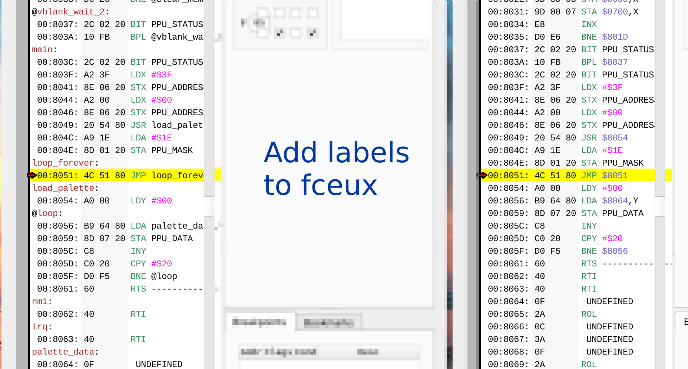
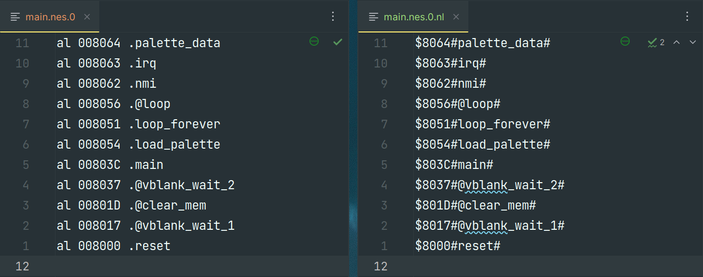

= ca65-symbls-to-nl

Small helper tool to convert cc65 label file into fceux namelist *.nl file.

== Usage
1. Build the tool like described in <<_build_install>>.
2. Build your NES assembly files with `-g` flag, which adds https://cc65.github.io/doc/ca65.html#ss2.1[debug info].
+
[source,sh]
----
ca65 -g main.s -o main.o
----
3. Tell you linker to generate symbol file with `-Ln`. This generates `main.nes` as well as `main.nes.0` which contains the symbols. Fceux can not understand this file.
+
[source,sh]
----
ld65 -Ln main.nes.0 main.o -o main.nes
----
4. Convert the file to a *.nl file.
+
[source,sh]
----
ca65-symbls-to-nl -f main.nes.0
----
This conversion looks like this:
+

5. Open your `.nes` file as usually. Fceux will automatically find the symbols file and show it accordingly, as long as your `.nes` and `.nes.0.nl` have the same base name.

[#_build_install]
== Build & Install
=== Prerequisites
* https://gcc.gnu.org/[gcc]: GNU Compiler Collection
* https://www.gnu.org/software/make/[make]: Build tool

=== Build
To build the application, run:
[source,sh]
----
make
----

=== Install
To install the application, set `DESTDIR` and run the install target.
Replace `<YOUR_INSTALL_PATH>` with the actual path you want to install to:
[source,sh]
----
make intall DESTDIR=<YOUR_INSTALL_PATH>
----
